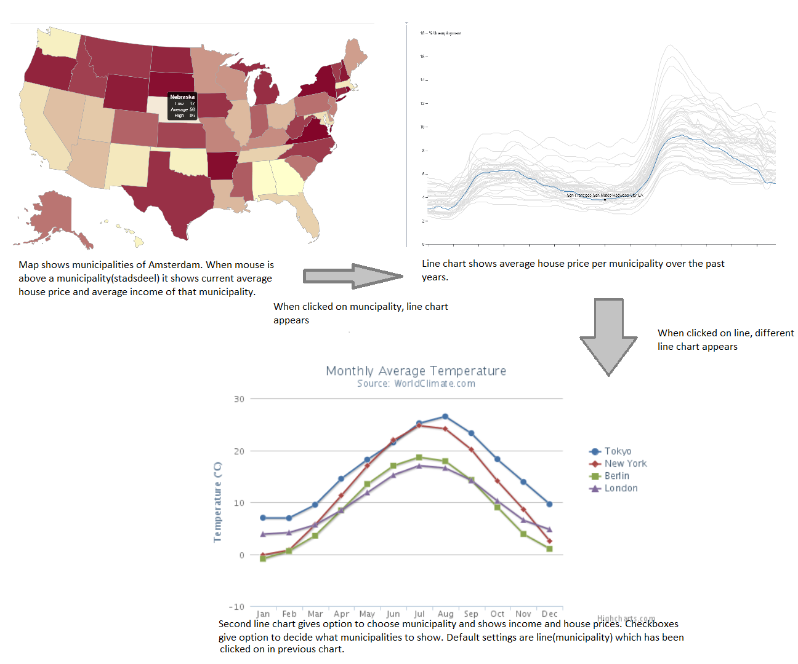

# Data-Visualization
Final Project Minor Programmeren UvA

## Problem statement 
The Amsterdam housing market is known to be overheated. In the past years the house prices have risen rapidly. The question rises if such a growth of house prices is sustainable on the long run and what the consequences of a faster growth rate of housing prices than income will have. Therefore, data will be visualized on these two variables to give insights in potential future scenarios of the Amsterdam housing market.

## Solution
Data that will be used are the average income and house prices in the submunicipalities of Amsterdam over the past years.
The target group of the visualization are people that live in Amsterdam or would like to live in Amsterdam.
The visualization will consist of an interactive map of Amsterdam and a line chart. The line chart will also give the option to compare submunicipalities average income and housing prices.

### MVP
- Interactive Map which links to line chart 1
- Line chart 1 that displays average house price for each submunicipality, highlighting line when mouse is above it.  When clicked on line go to line chart 2.
- Line chart 2 with checkboxes. Checkboxes decide what user can see. Line chart 2 also shows average income per submunicipality.

### Optional
- Zoom option in line charts
- Default settings for line chart 2 same as line clicked on in line chart 1
- Go to previous chart option
- Compare different cities

## Sources
- Gemeente Amsterdam
- CBS
